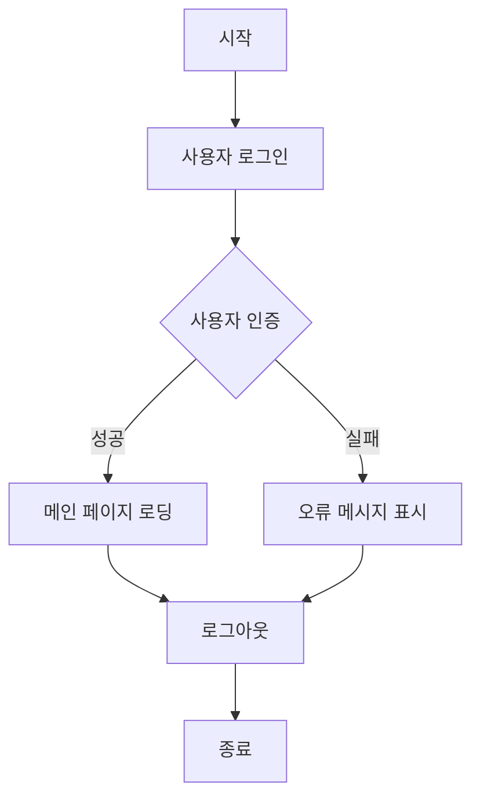

# AWS와 온프레미스를 접목한 하이브리드 클라우드 학교시스템 구현!

## 📅 프로젝트 기간
**2024.11.08 – 2024.12.27**

## 👨‍💼 팀 구성
**팀원 수:** 6명

## 🔠 프로젝트 개요
기존 학교 시스템은 수강신청과 같은 고트래픽 이벤트 발생 시 온프레미스 리소스의 한계로 인해 성능 저하 문제가 발생했습니다. 이를 해결하기 위해 온프레미스 리소스를 최대한 활용하면서, 리소스 한계를 초과할 경우 AWS로 자동 확장되는 하이브리드 시스템을 설계하고 구현했습니다. 이를 통해 트래픽 집중 상황에서도 안정적인 성능을 보장합니다.

---

## 📊 프로젝트 아키텍처

시스템은 온프레미스와 클라우드 환경을 결합하여 효율적으로 리소스를 관리합니다. 아래 아키텍처는 주요 구성 요소 간의 관계를 설명합니다:

### 주요 특징:
1. **온프레미스 구성:**
   - 주요 노드(Node 1 & Node 2), 예비 노드(Node 3), 그리고 전용 모니터링 및 관리 노드 포함.
   - Nginx를 활용한 온프레미스 네트워크 로드 밸런싱.
   - Prometheus와 Grafana를 사용하여 리소스 사용량 모니터링.

2. **AWS 통합:**
   - EKS 클러스터는 온프레미스 노드가 80% 이상의 리소스를 사용할 경우 오버플로우 트래픽을 처리.
   - AWS RDS는 전용 VPN을 통해 온프레미스 데이터베이스와 안전하게 동기화.

3. **CI/CD 파이프라인:**
   - GitHub Actions를 통해 지속적 통합, Docker 이미지 생성, Kubernetes 매니페스트 배포를 자동화.

4. **모니터링 및 자동 확장:**
   - Prometheus는 시스템 성능을 추적하고, 확장 로직은 임계값에 도달하면 추가 리소스를 활성화.

5. **보안:**
   - VPN을 통해 온프레미스 네트워크와 AWS 간의 안전한 통신 보장.

---

## ⚙️ CI/CD 파이프라인

빠르고 안정적인 배포를 위해 견고한 CI/CD 파이프라인이 구축되었습니다. 프로세스는 다음과 같습니다:

- **코드 개발:** 개발자가 GitHub 저장소에 코드를 푸시.
- **CI 과정:**
  - GitHub Actions를 통한 자동 테스트.
  - Docker 이미지를 빌드하고 컨테이너 레지스트리에 푸시.
- **CD 과정:**
  - Kubernetes 매니페스트를 적용하여 애플리케이션 배포.

---

## 💃 데이터베이스 ERD

데이터베이스 아키텍처는 시스템의 핵심 요소입니다. 엔터티 관계 다이어그램(ERD)은 테이블 간의 관계를 시각적으로 보여주며, 다양한 모듈에서 데이터 무결성을 보장합니다.

---

## 🕹️ 프로젝트 흐름

다음 다이어그램은 시스템 내 사용자 흐름을 설명합니다:

---

## 🚀 향후 계획

### 개선 계획:
1. **CI 환경 변경:**
   - 현재 GitHub Actions를 사용하여 CI를 구성했으나, 온프레미스에 적합하고 현업에서 많이 사용되는 Jenkins로 변경을 고려 중입니다.
2. **Registry 변경:**
   - 현재 GHCR(GitHub Container Registry)을 사용 중이나, 이미지 보안 강화를 위해 온프레미스에서 작동하는 Harbor로 전환할 계획입니다. 다만 오픈소스 사용에 대한 신뢰 문제를 추가 검토할 예정입니다.
  
3. **고급 인증 및 보안 강화:**
   - AWS Cognito를 사용 중이지만, 학교 시스템의 보안 강화를 위해 LDAP 기반 온프레미스 인증 시스템을 우선 적용하고, 이후 Cognito로 확장하는 방안을 구상 중입니다.

---

## 📆 결론

이번 프로젝트는 온프레미스 인프라와 AWS 클라우드 기능을 결합하여 비용 효율적이고 확장 가능한 리소스 관리 시스템을 구현하는 데 성공했습니다. 확장성과 성능을 최적화하여 고트래픽 이벤트 발생 시에도 안정적인 서비스를 제공합니다.

이번 프로젝트를 통해 얻은 경험은 향후 더 복잡한 시스템을 구축하는데 도움이 될거라 생각하고, 스타트업이나 초기 자본이 적은 회사에서 트래픽이 몰릴 수 있는 서비스를 만들었을 때 어떻게 진행해야할지에 대한 방향성을 제시한 것이라고도 생각하게 되었습니다.

